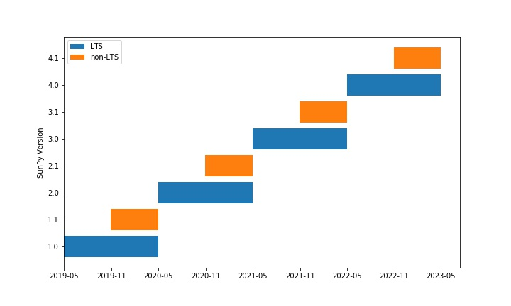

SunPy Release Schedule and Version Numbering
============================================

.. post:: June 27, 2019
   :author: Stuart Mumford
   :tags: sunpy
   :category: Update

In this blog post I want to outline how, and more over why, we are going to
number the SunPy releases and when we are going to release them.

**TLDR**; we are going to move to a 6 month release cadence, with a Long Term
Support (one year of support) release in May and a Short Term Support (6 months
of support) in November. We will increment the major version number for each LTS
release.

Background
----------

As part of the 1.0 release planning the SunPy developers and the board spent a
long time discussing how we want to version SunPy and what we want to use our
versioning a release schedule to achieve. We went through two major iterations
of this plan, the first can be found in the abandoned PR to the SunPy
Enhancement Proposal repository `#30 <https://github.com/sunpy/sunpy-SEP/pull/30>`__,
and the second one which was accepted in
`#40 <https://github.com/sunpy/sunpy-SEP/pull/40>`__.

Objectives
----------

In moving SunPy out of the 0.y series of releases we knew that our users would
be expecting us to make breaking changes less, and for them to be able to rely
on SunPy for longer.

We wanted to balance the desire for people to be able to start using SunPy for a
project and be able to see that project through without having to constantly
adjust to many changes in new releases. On the other hand, we wanted to also
allow the development of SunPy to continue without having to delay people
contributing improvements to SunPy because of a strict versioning scheme.

We also have to consider that, currently, SunPy core is developed entirely by
volunteers, and supporting old versions of the library is a time consuming and
sometimes thankless job.

Releases
--------

The solution we landed on is to provide a Long Term Support release that we will
support for one year (i.e. until the following LTS release). This gives people
who want stability a release schedule where they get bug fixes for a year. While
also allowing SunPy to do releases on a six month cycle to get new features out
for people to use.

To make it clear which releases are Long Term Support releases, we will
increment the major version (the first number) for each LTS release. This means
SunPy 1.0 is a LTS release which we will be supporting until the release of 2.0
in May 2020.

The all the non-LTS releases between the LTS releases will increment the minor
version number, as there is only one release planned between LTS releases the
normal release number will be 1.0, 1.1, 2.0, 2.1 etc.

Deprecations
------------

We still expect, and have plans for, changes to many parts of SunPy. We believe
these changes will enable even more people to find SunPy useful in their work.

To enable people to prepare for changes and to not be in for big surprises when
updating SunPy we will endeavour to emit a deprecation warning for any
breaking changes for *one LTS release*.

The upshot of this is that, if now after 1.0, we want to change something in a
backwards incompatible way we would continue to provide both the old and new
ways until after the 2.0 release. The 2.0 release would emit a deprecation
warning, to give people who go from LTS to LTS a year to update their code
before the next LTS.

Conclusion
----------

I hope this blog post gives you some insight into how we made this decision and
why, if you have any comments please don't hesitate to get in touch using any of
the usual ways.
