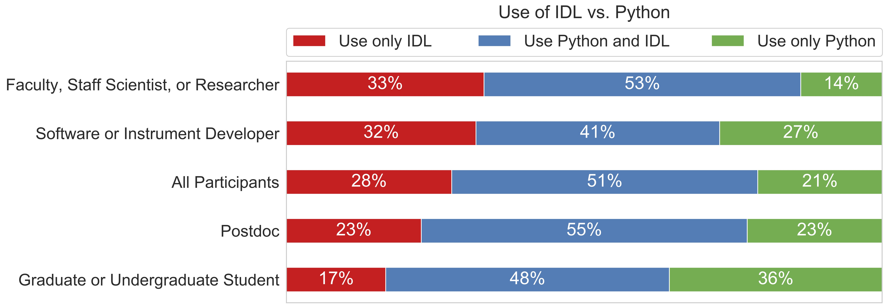
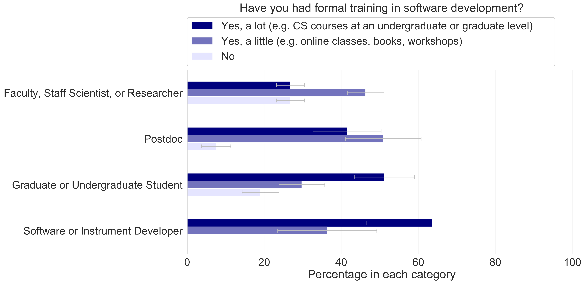
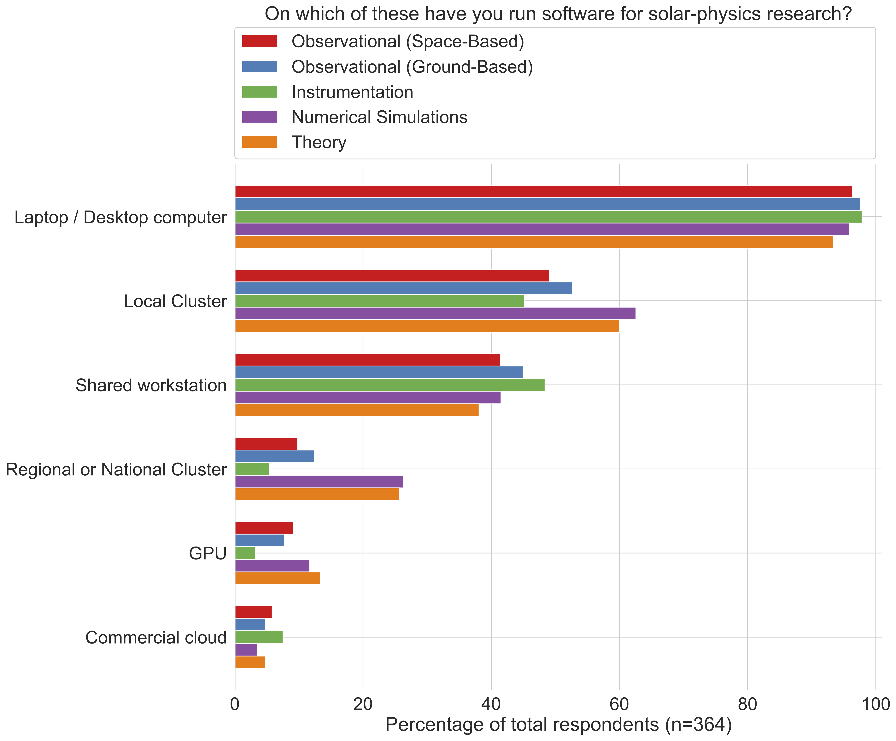
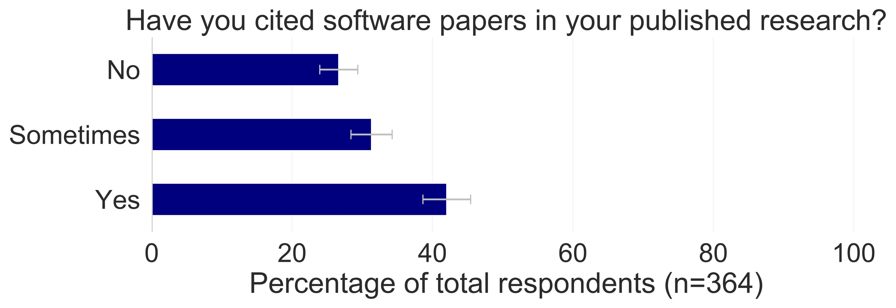

SunPy Survey
============

.. post:: April 27 2020
   :author: Monica Bobra
   :tags: sunpy
   :category: Update

The SunPy project is happy to announce the results of the solar physics community survey!

For six months last year, between February and July 2019, the SunPy Project asked the solar physics community to fill out a 13-question survey about software and hardware. Some of the questions were: Do you use software in your research? Have you had formal training in programming? Have you cited software papers in your published research?

We deliberately asked some of the same questions as `Momcheva and Tollerud (2015) <https://arxiv.org/abs/1507.03989>`__, who informally surveyed 1142 members of the astrophysics community, to compare software preferences between the two communities. A total of 364 community members, across 35 countries, took our survey.

What we found
------------- 

We found that 99±0.5% of people who responded to our survey use software in their research. Nearly everyone in the solar physics community relies on scientific software. A large fraction (66%) of respondents use Python. Most respondents use both Interactive Data Language (IDL) and Python. 

However, students are twice as likely as faculty, staff scientists, and researchers to use Python. This breakdown is pretty different from the astrophysics community, where Momcheva and Tollerud (2015) found that Python is the most popular programming language within every individual career category. 

We also found that most respondents (63±4%) haven't taken any computer science courses at an undergraduate or graduate level. Momcheva and Tollerud (2015) also found that most astrophysicists also lack formal training in software development. 

Most of the people who responded to our survey work with observational data taken by ground-based or space-based instruments (82%). And about half (47%) work with numerical simulations. Some work in both sub-disciplines. Although some instruments and numerical models in solar physics generate sizeable data volumes, only a small fraction of respondents use a regional cluster, national cluster, or the commercial cloud for their research. 

Finally, we found that 42±3% of respondents regularly cite scientific software. Half the respondents who don't cite software said they didn't know how.

Our paper
--------- 

Please check out our paper! We detailed all of these results, and more, in a paper published on April 20, 2020 (DOI: `10.1007/s11207-020-01622-2 <https://doi.org/10.1007/s11207-020-01622-2>`__). We also included an appendix on how to cite scientific software. You can also take a look at all the raw survey responses (anonymized and randomized), along with the code to analyze these data, at `github.com/sunpy/survey <https://github.com/sunpy/survey>`__.