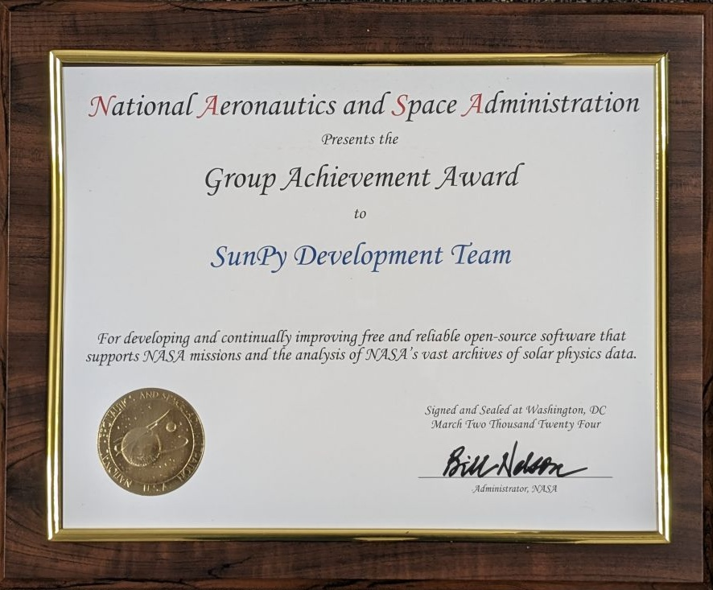

# SunPy Development Team wins a NASA Group Achievement Award!

We are delighted to announce that the SunPy development team has been awarded with a NASA Group Achievement Award! 

The award was given to our team for "developing and continually improving free and reliable open-source software that supports NASA missions and the analysis of NASA’s vast archives of solar physics data".

This award is a collective achievement, and we share it with everyone who has contributed to SunPy!
We look forward to continuing our mission of supporting solar physics research and making impactful contributions to the scientific community.

    

